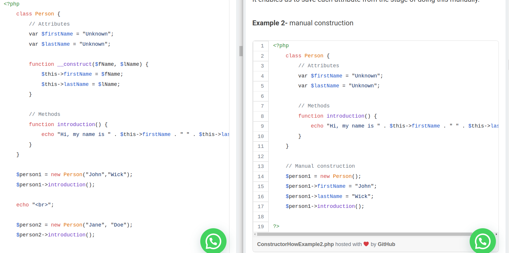
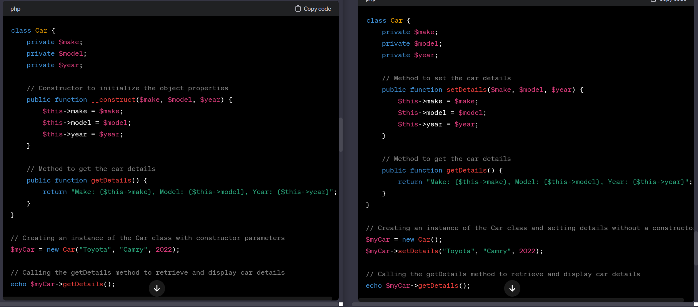

# PHP Class

- What are Classes and Objects?
- class is a blueprint/template for creating objects. 
- class is a group of object. 
- Objects are instances(something that happens generally) of classes, and each object can have its own unique data (properties/variable)    and behavior (methods/function) defined by the class.
- class define property(called attribute fields) & method (function associate with class).


``` php
class Person {
    // Properties
    public $name;
    public $age;

    // Constructor
    public function __construct($name, $age) {
        $this->name = $name;
        $this->age = $age;
    }

    // Method to display information about the person
    public function displayInfo() {
        echo "Name: " . $this->name . "<br>";
        echo "Age: " . $this->age . " years old<br>";
    }
}

// Creating an instance of the Person class
// Objects are instances(something that happens generally) of class
$person1 = new Person("John Doe", 25);

// Accessing properties directly (not recommended, usually use methods)
echo "Direct access: " . $person1->name . "<br>";

// Accessing properties using a method
$person1->displayInfo();

var_dump($person1) // object(Person)#1 (2) { ["name"]=> string(8) "John Doe" ["age"]=> int(25) }
echo(gettype($person1)); // object
```


# Define Objects

- Classes are nothing without objects
- We can create multiple objects from a class. 
- object has properties and methods defined in the class, but they will have different property values.
- Objects of a class are create new keyword.


## objects are instances of classes

- Objects of a class are create new keyword
``` php
// Creating an object of the person class
$person1 = new Person();
```
- new Person() creates a new instance of the person class
- reference to this instance is stored in the variable $person1.


## Constructor 

  <p align="center"><a href="Constructor.png" target="_blank"></a></p>
  <p align="center"><a href="Constructor1.png" target="_blank"></a></p>
